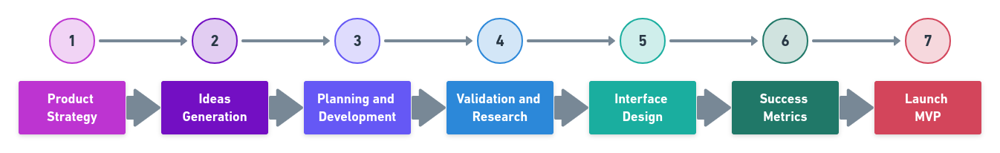

# UX Tools

## UI/UX

## UX

## UI

## UX Tools and Methods

### 1. Product strategy

How to **discover** and **create** what people need.

* [Blueprints](https://medium.com/@cynthiarisse/service-blueprinting-69ce8fd0509)
* [Customer Journey Map](https://medium.com/@uxmastery/how-to-create-a-customer-journey-map-42e6ac7d8757)
* [Ecosystem](https://www.uxbooth.com/articles/designing-digital-strategies-part-1-cartography/)
* [Golden Path](https://medium.com/startup-by-design/goldenpath-156c1ff291ab)
* [Future Press Release](https://uxdesign.cc/a-press-release-before-ux-design-df250539c974)
* [Personas](https://medium.com/beakerandflint/personas-74c4e1c12ee2)
* [Value Proposition](https://medium.muz.li/ux-diary-6-value-proposition-af7be6f79139)
* [Value Proposition Canvas](https://medium.com/greater-than-experience-design/whats-your-value-proposition-3de5eee48cf0)
* [Lightning Talks](https://medium.com/googlesprint/design-challenge-78ef1dcad26e)
* [Pixar Storytelling](https://uxdesign.cc/treating-your-product-design-work-like-its-a-pixar-movie-7c1a0fe62491)
* [Stakeholders Map](https://uxdesign.cc/presenting-your-design-to-stakeholders-1695526a1457)
* [Business Model Canvas](https://medium.com/@fernandocomet/ux-canvas-compilation-6718822d9a22)
* [First Tweet](https://medium.com/googlesprint/the-define-stage-stage-2-24f6b8088426)
* [Benchmark](https://measuringu.com/benchmark-intro/)
* [Metrics](https://medium.com/@jcoronado1/quick-resource-guide-to-ux-metrics-a97cf7727b2b)

### 2. Ideas Generation

How to **externalize** and **communicate** what you have in mind.

* [Double Diamond](https://medium.com/design-leadership-notebook/the-new-double-diamond-design-process-7c8f12d7945e)
* [Storyboard](https://medium.com/thinking-design/the-what-why-when-of-storyboarding-in-ux-design-38db2f955e23)
* [How might we?](https://medium.com/knowsi/hmw-how-might-we-c04423a4437d)
* [Crazy 8's](https://blog.prototypr.io/how-to-run-a-crazy-eights-workshop-60d0a67b29a)
* [User Flow](https://medium.com/7bits/user-flow-101-what-it-is-how-to-do-it-84052141fe86)
* [Moodboard](https://www.webdesignerdepot.com/2008/12/why-mood-boards-matter/)
* [Taxonomy](http://johnnyholland.org/2012/04/taxonomy-content-strategys-new-best-friend/)
* [Design Principles](https://medium.com/googlesprint/the-define-stage-stage-2-24f6b8088426)
* [Sitemap](https://uxmentor.me/sitemaps-the-beginners-guide/)
  
### 3. Planning and Development

How to **execute** good ideas.

* [User Stories](https://uxdesign.cc/better-stories-with-job-story-3467de354f45)
* [Roadmap](https://uxdesign.cc/developing-a-product-roadmap-a62bc5f1a15b)
* [Job Story](https://jtbd.info/5-tips-for-writing-a-job-story-7c9092911fc9)
* [Project Model Canvas](https://medium.com/bigcommerce-developer-blog/using-an-experience-canvas-to-determine-your-next-feature-1e97c7e76388)

### 4. Validation and Research

How to **evaluate** the solution of the problems and **improve** the product.

* [Heuristic Analysis](https://www.usabilityfirst.com/usability-methods/heuristic-evaluation/)
* [Diary Studies](https://medium.com/user-research/user-research-weekly-9-diary-studies-e53d9312b485)
* [Quantitative and Qualitative Research](https://medium.com/ux-design-web-mobile-virtual-reality/12-ux-research-techniques-quantitative-and-qualitative-1a37bcb1914e)
* [Landing page](https://medium.com/@distillerytech/how-to-design-an-effective-landing-page-e9bffaccfdc5)
* [A/B Test](https://medium.com/intent-media-design/the-art-of-the-a-b-test-statistics-101-for-ux-designers-ux-researchers-780229e1e378)
* [Content audit](https://uxmastery.com/how-to-conduct-a-content-audit/)
* [Focus Group](https://medium.com/pminsider/how-to-lead-ux-research-focus-groups-8d5cb960ad3e)
* [Card Sorting](https://medium.com/@yangchen/card-sorting-a-simple-and-effective-ux-research-tool-74befc3ef4ef)
* [Accessibility analysis](https://medium.com/salesforce-ux/7-things-every-designer-needs-to-know-about-accessibility-64f105f0881b)
* [User Feedback](https://uxdesign.cc/the-importance-of-user-feedback-20a773908325)
* [Usability interviews](https://medium.com/@MentallyFriendly/usability-testing-101-939c83ffe565)

### 5. Interface Design

How to **transform** ideas into sketch, prototypes and products. **Usability** and utility.

* Rabisco frame
* Prototipos
* Usabilidade
* Wireframes
* Biblioteca de padrões
* Design colaborativo

### 6. Success Metrics

Objectively **evaluate** the results of the product.

* KPIs
* CTR
* NPS
* DAU
* Baseline
* HEART
  
### 7. Launch

How to launch the **MPV**. **Learn fast** and succeed.

* Entrevistas
* Prototipos codificados
* Concierge
* Prototipos de baixa fidelidade
* Prototipos de Alta e media fidelidade

#### More interesting tools

(ideas)
* [FlowMapp](https://www.flowmapp.com/) Full stack UX platform.
* [Marvel](https://marvelapp.com/) Rapid prototyping, testing and handoff.
* [inVision](https://www.invisionapp.com/) Create rich interactive prototypes.
* [MoodBoard](http://www.gomoodboard.com/) Build beautiful, simple, free moodboards.
  
(planning)
* [Trello](https://trello.com/) Keep track of everything.

(validation)
* [Unbonce](https://unbounce.com/) Design Beautiful Landing Pages.
* [Klickpages](https://klickpages.com.br/)Ferramenta para criar landing pages.
* [OptimalSort](https://www.optimalworkshop.com/optimalsort/) Discover how people categorize information.

#### More interesting links

* [UX Design Methods In A Mind Map](https://uxplanet.org/product-design-methods-mind-map-f6511820a7d5)
* [UX Design Methods & Deliverables](https://uxdesign.cc/ux-design-methods-deliverables-657f54ce3c7d)
* [The Basic Principles of UX Design](https://medium.com/@riesdiansyah_64327/the-principles-of-ux-design-561c3a759e79)
* [Curated list for UI/UX Designers](https://github.com/gregjw/ui-ux)
* [UX_UI](https://github.com/alexUXUI/UX_UI)

#### Reference

* [UX & Design Thinking: Experiência do Usuário nos negócios](https://www.udemy.com/course/ux-design/)
---
made with 💙 by [mafda](https://mafda.github.io/)